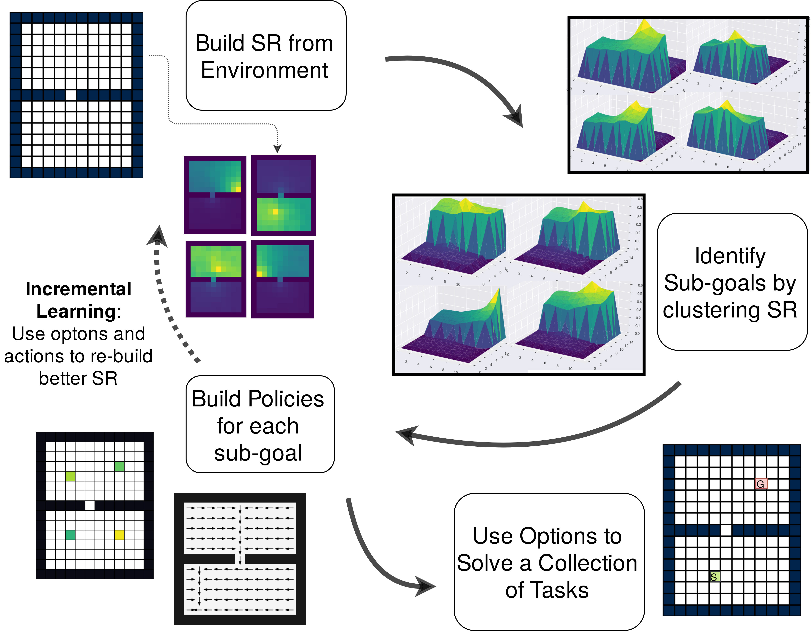

# Successor Options

This repo contains code for the paper [Successor Options](https://www.ijcai.org/proceedings/2019/0458.pdf)

Our method clusters the state space into different regions and learns options navigating to each of these clusters.

   


* To install all required packages run 

```
pip install -r requirements.txt
```


Files and their utilities
=========================

| File                    | Utility                                |
|-------------------------|----------------------------------------|
| buildIncrementalSR      | Code for building Inc-SR-options       |
| buildPoliciesEigen      | Code for building Eigen-options        |
| buildPoliciesSuccessor  | Code for building SR-options           |
| successor               | Class defining SR-options              |
| laplacian               | Class defining Eigen-options           |
| visualize               | Class defining SR-options              |
| evaluateSR              | Evluates SR options and Eigen-options  |
| support/                | Helper functions for SR/Eigen options  |
| env/                    | Grid-world environment wrappe          |
| data/                   | Folder to store policies               |
| images/                 | Folder to store images                 |
